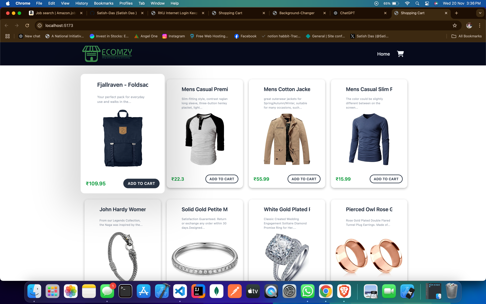
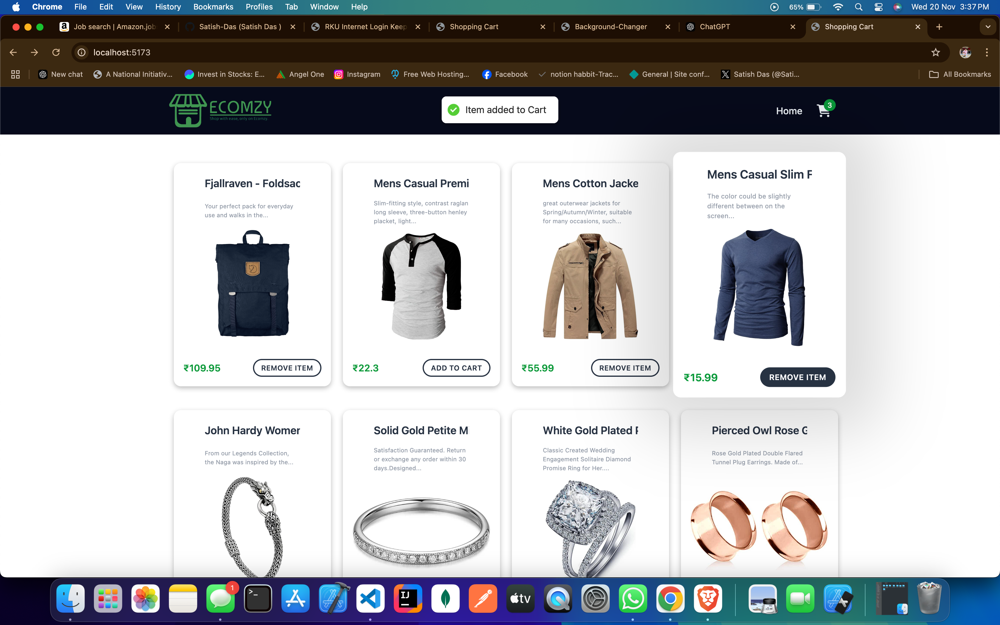
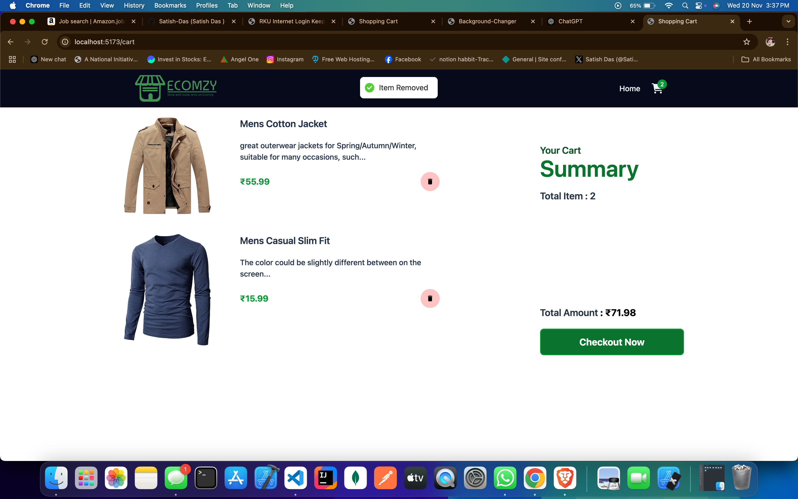

# Shpping Cart Application

The Shopping Cart Application is a feature-rich e-commerce interface built to demonstrate the functionality of a shopping cart system. Users can browse products, add or remove items from the cart, and view a summary of their purchases in a clean, user-friendly design.

**Key Features: **
Product Listing Page:
The main interface displays a grid of products with details such as name, price, and description. Users can interact with each product using the following options:

**Add to Cart: Add an item to the shopping cart.**
Remove Item: Remove a specific product from the listing.
Shopping Cart Summary:

**The cart page shows all added items, including the product name, price, and a small description. **
A "Remove" button next to each product allows users to delete items from the cart easily.
A "Summary" section provides a clear overview of:
Total items in the cart.
Total cost of the selected products.
A "Checkout Now" button enables the user to proceed with the purchase.

** Real-Time Feedback: **

Notifications like "Item added to Cart" and "Item Removed" provide real-time feedback to enhance the user experience.
Modern UI/UX Design:

The application incorporates a professional and intuitive design with a focus on usability and simplicity.
Clear typography and visual hierarchy make it easy for users to navigate and interact with the application.
This Shopping Cart Application is ideal for learning and showcasing the core functionalities of an e-commerce website, including React state management, event handling, and UI component integration.

**Technologies Used:**
React: JavaScript library for building user interfaces.
tailwindcss: A utility-first CSS framework for rapid UI development.
GitHub: Version control and project management.

**Getting Started:**

To run the Shopping Cart Application on your local machine, follow these steps:

1. npm install

2. npm run dev

3. Open http://localhost:5173 to view the application in your browser.

** ## Screenshots: **   

** Home Page:**

** Item-added to Cart:**

** Cart Page:**

